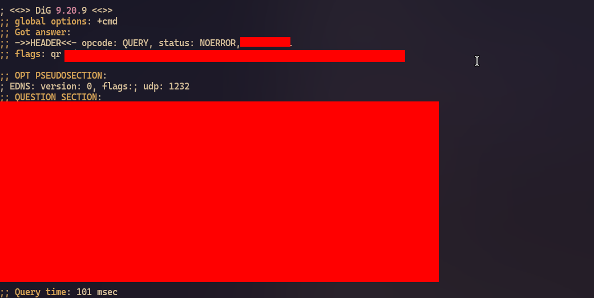
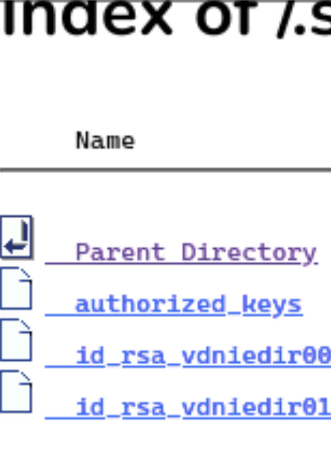

# Security Vulnerability Disclosure: Spanish National Police; Exposed SSH Private Keys

## TL;DR

**Beginning of August 2025**: While conducting security scans on my own video game server infrastructure to identify vulnerabilities, I discovered an public internet facing server via Shoadan, this server was the property the **Spanish National Police**, I found that this webserver had multiple exposed ssh private keys stored on it, I then helped to responsibly disclosure this security vulnerability to the affected party.

## Initial Discovery

During my personal port scan using Shodan, I identified a server with IP the address `[redacted]`, I performed a reverse DNS lookup

Using the `dig` tool, I did a reverse DNS lookup on the flagged IP address:



The reverse lookup pointed to a CNAME record, which then pointed to the domain: `pki.policia.es`

I ran a whois lookup to confirm the domain ownership:

```txt
This TLD has no whois server, but you can access the whois database at https://www.dominios.es/en
```

The whois lookup returned an error which showed the domain didn't have a whois server, this was strange. I then did some further investigation and found that this was common among domains which aren't for public use & where the TLD and the domain registrant are the same organization. I then found that it was an official Spanish National Police domain.

## Technical Assessments

### Port Scanning

I performed an nmap scan on the domain to identify exposed services. The scan revealed a standard file server running a web interface on the HTTPS port.

I visited the webserver and found that it contained malicious documents that did not appear to contain sensitive information

### Directory Enumeration

I then cross-referenced the webserver type using guides like [this](https://owasp.org/www-project-web-security-testing-guide/latest/4-Web_Application_Security_Testing/01-Information_Gathering/02-Fingerprint_Web_Server), I then found that this webserver supported hidden directories which server maintainers could create & would automatically be assigned to hidden unix directories (which start with .).

I created a bash script to test common file paths that are often overlooked during file server configuration. Based on my personal experience with webservers, I knew certain directories are frequently left with default permissions.
The script simply enumerated over common hidden directories, and stored successful 200 codes with valid directories structures in a .txt file

One of the paths I tested, `/.ssh` (the root-level SSH directory of the file server), returned a successful HTTP 200 response code. This directory contained SSH keys used for server authentication and access, this is a major security vulnerability as private ssh keys essentially act as passwords to servers on the internet.



## Responsible Disclosure

Upon discovering the exposed SSH keys, I immediately recognized the serious security implications. I contacted a native Spanish speaking friend who has experience with responsible vulnerability disclosure. I provided him with my findings and the technical details so he could properly contact the Spanish National Police.

## Resolution Status

This vulnerability was disclosed via email & was responsibly disclosed to ensure proper remediation
As of August 2025, the `/.ssh/` directory redirects to `/` and doesn't seem accessible to the public internet anymore

---

- Where I have redacted information, I understand that most of this information is trivially easy to lookup in historical  databases and public records, however it will still remain redacted and **will NOT** be supplied on request.
- *No malicious actions were taken by me, all findings were immediately reported to appropriate parties for remediation.*
